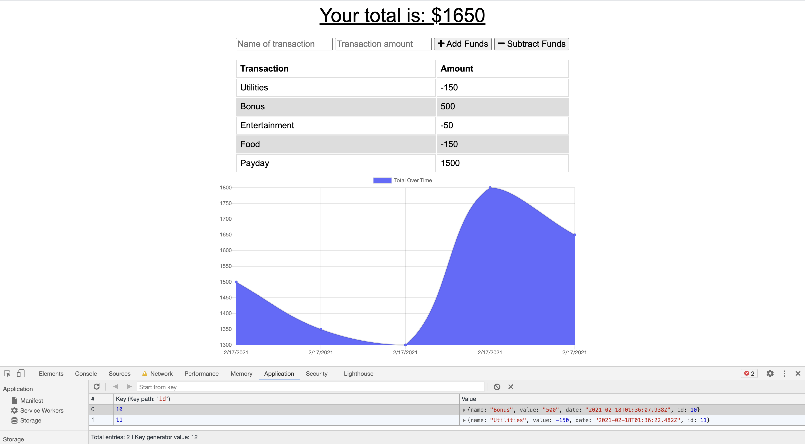
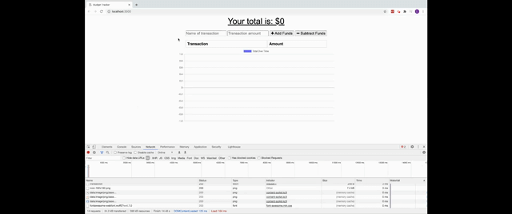

# Budget-Tracker

## Description

This application allows a user to view and track their expenses and deposits with or without an internet connection. When the user is without a connection, it stores the transaction as pending until they are once again connected to the internet.

## Technologies

IndexedDB, MongoDB, Mongoose, Node, Express, JavaScript

## Table of Contents

* [Links](#links)

* [Usage](#usage)

## Links

* [GitHub Repo](https://github.com/elizabethbrandt/Budget-Tracker)

* [Heroku Deployment](https://budget-tracker-eb.herokuapp.com/)

## Usage

* A user can enter their financial transactions (withdrawls or deposits) into the application with or without an internet connection.

* When the user doesn't have an internet connection the transactions are saved as pending until the connection is returned.

* Once the user refreshes the page with the connection, the transactions are pulled out of pending status and added to the database.

* Demo

